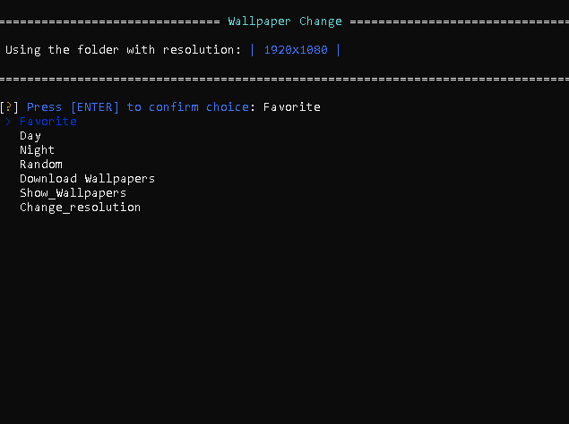
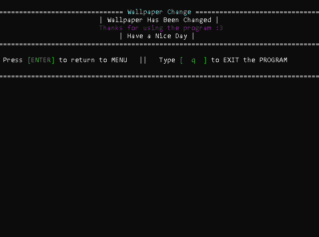

# Wallpaper Change Program

A Python program that allows you to easily change wallpapers on your computer based on different options.

---

## Table of Contents

- [Description](#description)
- [Features](#features)
- [Requirements](#requirements)
- [Installation](#installation)
- [Usage](#usage)
- [Screenshots](#screenshots)
- [License](#license)
- [Contributing](#contributing)
- [Contact](#contact)

---

## Description

The Wallpaper Change Program is a command-line tool written in Python that allows you to change wallpapers on your computer. It provides various options such as setting favorite wallpapers, changing wallpapers based on the time of day, selecting wallpapers randomly, and more. Working on Windows [Not sure if it will work on MAC] 

---

## Features

- Change wallpapers based ron different categoies:
  - Favorite
  - Day
  - Night
  - Random
- Open popular websites where you can download wallpapers
- Choose wallpapers from your specified folders

---

## Requirements

- Python 3.x
- Required Python packages are listed in the `requirements.txt` file.

---

## Installation

1. Clone the repository to your local machine: `git clone https://github.com/your-username/wallpaper-change-program.git`

2. Navigate to the project directory: `cd wallpaper-change-program`

3. Install the required Python packages using pip: `pip install -r requirements.txt`

4. Run the program: `python Change_Wallpaper.py`
---

## Usage

1. Follow the on-screen prompts to choose your desired options for changing wallpapers.

2. You can add your own wallpapers in those folders in which category you want:

  - Favorite
  - Day
  - Night

3. Enjoy your new wallpapers!

---

## Screenshots

---

## License

This project is licensed under the [MIT License](LICENSE).

---

## Contributing

Contributions are welcome! If you encounter any issues or have suggestions for improvements, please open an issue or submit a pull request.

---

## Contact

For any inquiries or feedback, please feel free to reach out to me at szy.sloniowski@gmail.com. You can also explore my [GitHub profile](https://github.com/DimmeSs) for more insights.